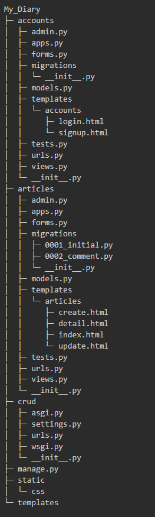

# Django BackEnd
Django를 활용하여 간단한 게시판을 만들어보았습니다❗


## 개발환경
- Python 3.12.0
- Django 4.2.6
- MySQL


## 프로젝트 구조



## 프로젝트 API 요소
1. articles
```
- 전체 게시글 조회
- 게시글 생성
- 특정 게시글 조회
- 게시글 삭제 
- 게시글 수정
- 댓글 작성
- 댓글 삭제
```

2. accounts
```
- 로그인 
- 회원가입
- 로그아웃
- 회원탈퇴
```